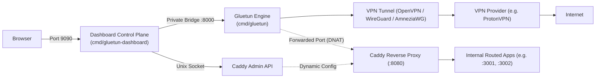

# Xoi

> **Enhanced Gluetun VPN client with an unprivileged React/Go management dashboard and dynamic Caddy reverse-proxy ingress control plane.**

Maintained by [Curry06](https://github.com/Curry06/Xoi) • Forked from [Gluetun](https://github.com/qdm12/gluetun)

---

## Fork Attribution & Acknowledgements

**Xoi** is built as a fork of the open-source **[Gluetun](https://github.com/qdm12/gluetun)** project created by **Quentin McGaw** ([@qdm12](https://github.com/qdm12) / [passteque](https://github.com/passteque)) and its many contributors.

- **Upstream Repository:** [github.com/qdm12/gluetun](https://github.com/qdm12/gluetun) / [github.com/passteque/gluetun](https://github.com/passteque/gluetun)
- **Upstream Documentation & Wiki:** [github.com/qdm12/gluetun-wiki](https://github.com/qdm12/gluetun-wiki)

Huge gratitude and appreciation go to Quentin McGaw and the entire Gluetun community for creating and maintaining the rock-solid, multi-provider VPN engine, firewall kill-switch, DNS-over-TLS, and port-forwarding data plane that powers this project.

---

## What Xoi Adds

While upstream Gluetun focuses on being a lightweight, headless VPN container client, **Xoi** introduces a full management and application exposure suite:

1. **Unprivileged Web Dashboard & Control Plane (`cmd/gluetun-dashboard`)**:
   - Built with **Go 1.26** and an embedded **React 19** SPA (TypeScript + Vite + Tailwind CSS).
   - Serves an interactive Web UI on port `9090` without needing `NET_ADMIN` or raw network capabilities.
   - Real-time status monitoring for VPN connections, public IP lookups, open ports, and health status.
   - Server profile switching and persistent connection history stored locally as JSON in `/data`.

2. **Dynamic Ingress & Public Applications (Caddy 2)**:
   - Seamlessly host web services behind dynamic VPN port-forwarding leases (e.g., ProtonVPN NAT-PMP).
   - Ingress traffic is automatically routed via a shared-namespace **Caddy 2** reverse proxy.
   - Atomic route management: validate, apply via private Unix socket, and auto-rollback on failure.
   - Domain and path-based routing directly to target containers.

3. **Event Alerts**:
   - Integrated Telegram bot notifications for tunnel state, IP address changes, and port-forward lease updates.

4. **Hardened Multi-Binary Architecture**:
   - Strict privilege boundary: the privileged engine (`cmd/gluetun`) is completely isolated from the unprivileged dashboard (`cmd/gluetun-dashboard`).

---

## Core Engine Features

Xoi inherits all of Gluetun's networking and VPN capabilities:

- **Supported VPN Providers**: AirVPN, Cyberghost, ExpressVPN, FastestVPN, Giganews, HideMyAss, IPVanish, IVPN, Mullvad, NordVPN, Privado, Private Internet Access (PIA), PrivateVPN, ProtonVPN, PureVPN, SlickVPN, Surfshark, TorGuard, VPNSecure.me, VPNUnlimited, Vyprvpn, Windscribe, and Custom configurations.
- **Protocols**: OpenVPN, WireGuard (kernelspace & userspace), and AmneziaWG.
- **Built-in Firewall Killswitch**: Blocks traffic leaks when VPN tunnels drop.
- **DNS Security**: DNS-over-TLS (DoT) with optional ad/malware domain blocking and 24-hour live updates.
- **Built-in Proxies**: HTTP proxy, SOCKS5 proxy, and Shadowsocks proxy.
- **Dynamic Port Forwarding**: Provider-side port forwarding support for ProtonVPN (NAT-PMP), PIA, and PrivateVPN.
- **Multi-Architecture**: amd64, ARM64, ARM 32-bit v6/v7, and ppc64le.

---

## Architecture Overview



---

## Quick Setup

Run the full stack (Engine, Dashboard, and Caddy reverse proxy) using Docker Compose:

```bash
docker compose -f docker-compose.dashboard.yml up -d
```

### Example `docker-compose.dashboard.yml` Configuration

```yaml
services:
  # 1. Privileged VPN Engine
  gluetun:
    image: qmcgaw/gluetun:latest
    container_name: gluetun-engine
    restart: unless-stopped
    cap_add:
      - NET_ADMIN
    devices:
      - /dev/net/tun:/dev/net/tun
    environment:
      - VPN_SERVICE_PROVIDER=protonvpn
      - VPN_TYPE=openvpn
      - OPENVPN_USER=${OPENVPN_USER}
      - OPENVPN_PASSWORD=${OPENVPN_PASSWORD}
      - VPN_PORT_FORWARDING=on
      - VPN_PORT_FORWARDING_PROVIDER=protonvpn
      - VPN_PORT_FORWARDING_LISTENING_PORTS=8080
      - HTTP_CONTROL_SERVER_ADDRESS=0.0.0.0:8000
    networks:
      - vpn-management

  # 2. Unprivileged Control Center Dashboard
  dashboard:
    build:
      context: .
      dockerfile: Dockerfile.dashboard
    container_name: gluetun-control-center
    restart: unless-stopped
    depends_on:
      - gluetun
    networks:
      - vpn-management
    ports:
      - "127.0.0.1:9090:9090"
    environment:
      - DASHBOARD_HTTP_ADDRESS=0.0.0.0:9090
      - DASHBOARD_AUTH_REQUIRED=true
      - DASHBOARD_ADMIN_USERNAME=admin
      - DASHBOARD_ADMIN_PASSWORD=admin123
      - DASHBOARD_DATA_DIR=/data
      - GLUETUN_CONTROL_URL=http://gluetun:8000
      - CADDY_ADMIN_URL=unix:///run/caddy/admin.sock
      - CADDY_INGRESS_URL=http://gluetun:8080
    volumes:
      - dashboard-data:/data
      - caddy-admin:/run/caddy

  # 3. Dynamic Reverse Proxy (Caddy)
  caddy:
    image: caddy:2.9-alpine
    container_name: gluetun-reverse-proxy
    restart: unless-stopped
    depends_on:
      - gluetun
    network_mode: "service:gluetun"
    volumes:
      - caddy-admin:/run/caddy
      - ./deploy/caddy/Caddyfile:/etc/caddy/Caddyfile:ro

networks:
  vpn-management:
    driver: bridge

volumes:
  dashboard-data:
  caddy-admin:
```

Once running, access the dashboard at `http://localhost:9090` (default login: `admin` / `admin123`).

---

## Documentation

Detailed architectural and developer documentation is located in [`docs/`](docs/README.md):

- [System Overview](docs/architecture/system-overview.md)
- [Public Applications & Caddy Proxy](docs/architecture/public-applications.md)
- [Component Architecture](docs/architecture/component-architecture.md)
- [Networking & Firewall Design](docs/architecture/networking.md)
- [API Reference](docs/reference/api-reference.md)

---

## License

This project is licensed under the [MIT License](LICENSE), consistent with upstream Gluetun.
