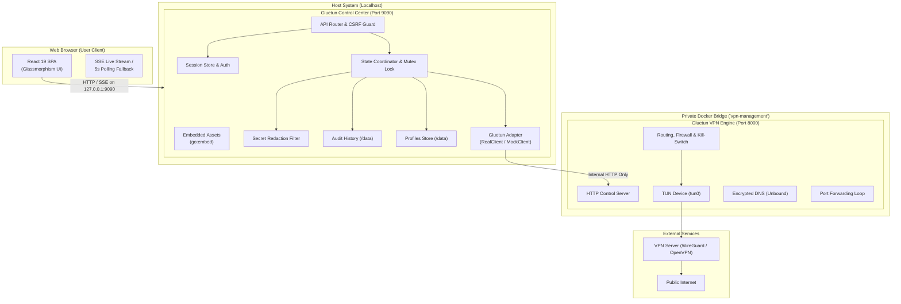

# Gluetun Control Center: Architecture Overview

Gluetun Control Center is a production-grade management layer for the official Gluetun VPN client. It decouples the core VPN network engine from user-facing controls, enforcing strict security boundaries, secret sanitization, and state synchronization.

---

## Architectural Topology

---

## Key Design Principles

### 1. Isolated VPN Engine Responsibility
- Gluetun remains the sole VPN engine. No cryptographic primitives, WireGuard handshakes, OpenVPN binaries, or iptables rules are reimplemented in Go or JavaScript.
- Gluetun's internal HTTP control server (`:8000`) is placed on a private Docker bridge network and **is never exposed to the host or internet**.

### 2. Zero Secret Exposure
- Passwords, private keys, and authorization headers are scrubbed before reaching the browser or persisted history.
- VPN settings returned by Gluetun's `GET /v1/vpn/settings` pass through `internal/dashboard/redaction`, redacting base64 keys, pre-shared keys, passwords, and tokens.

### 3. Concurrency Locking & Atomic Operations
- VPN state changes (connect, disconnect, server switch) are synchronized via a mutex lock within the State Coordinator.
- Concurrent requests while a transition is underway are rejected with `409 Conflict (OPERATION_IN_PROGRESS)`.
- If an operation fails, the system rolls back and logs the event to the audit history.

### 4. Resilient Live State
- The frontend connects to a Server-Sent Events (SSE) stream (`/api/dashboard/events/stream`) for instant updates.
- If SSE disconnects, the client gracefully falls back to 5-second polling with exponential backoff.
- The UI never hides the last known state while fetching fresh data; instead, it displays a subtle `STALE` indicator.

---

## Backend Subsystem Responsibilities

| Package | Purpose |
|---|---|
| `cmd/gluetun-dashboard` | Main executable, environment parsing, signal handling, graceful shutdown. |
| `internal/dashboard/api` | REST router, route handlers, error responses, CSRF and authentication middleware. |
| `internal/dashboard/auth` | Session token generation, cookie validation, CSRF verification. |
| `internal/dashboard/gluetun` | HTTP client wrapper for Gluetun endpoints and realistic mock adapter. |
| `internal/dashboard/history` | Ring-buffer persistence of IP changes, port updates, and user audits. |
| `internal/dashboard/profiles` | Storage for user connection profiles (guaranteed secret-free). |
| `internal/dashboard/redaction` | Automated pattern and key-based secret masking. |
| `internal/dashboard/state` | Coordinates state aggregation, periodic polling, transitions, and traffic rates. |
| `internal/dashboard/web` | `go:embed` asset delivery with SPA fallback routing. |

---

## Frontend Component Tree

- **DashboardLayout**: Sidebar navigation, header connection pill, public IP badge, engine version, mock mode alert banner, and system status indicator.
- **OverviewPage**: Connection Hero card, quick disconnect/reconnect actions, traffic bandwidth charts, public IP geolocations, and quick profile switcher.
- **ServersPage**: Server Explorer with search, country filter, protocol filters, latency indicators, and server switch confirmation.
- **PortForwardingPage**: Live forwarded port status, endpoint copy shortcuts, QR code generator modal, and external reachability testing.
- **NetworkPage**: Kill-switch verification, encrypted DNS resolver status, protocol inspection, and server-list updater trigger.
- **ProfilesPage**: Profiles CRUD, duplication, favoriting, import/export, and one-click connection application.
- **ActivityPage**: Chronological audit log of connection states, IP allocations, port assignments, and diagnostic log export.
- **SettingsPage**: Refresh intervals, unit preferences, test endpoints, and mock scenario switching.
