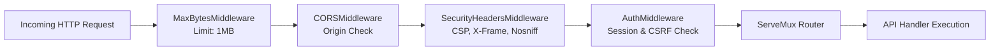

# Architecture: Backend Architecture

This document details the architecture, request pipelines, concurrency controls, and security models of the server-side applications in this repository.

---

## 1. Dual Backend Architecture

The backend consists of two cooperating server applications:

| Characteristic | Gluetun Engine Daemon | Control Center Dashboard Daemon |
|---|---|---|
| **Entry Point** | [`cmd/gluetun/main.go`](file:///home/vedx/Videos/Gul/cmd/gluetun/main.go) | [`cmd/gluetun-dashboard/main.go`](file:///home/vedx/Videos/Gul/cmd/gluetun-dashboard/main.go) |
| **HTTP Port** | `:8000` (internal bridge only) | `:9090` (loopback / reverse proxy) |
| **Linux Permissions** | `CAP_NET_ADMIN`, `/dev/net/tun` | Non-root `UID 1000`, `cap_drop: [ALL]` |
| **Network Interface** | Direct netlink/iptables manipulation | Internal HTTP client to engine |
| **Client Interface** | Raw internal JSON REST | Sanitized REST + SSE Live Stream |
| **Secrets Exposure** | Holds private keys and credentials | 100% redacted; zero secret leakage |

---

## 2. Dashboard Middleware Chain

All requests entering the Control Center HTTP server on port `:9090` pass through a sequential middleware pipeline defined in [`internal/dashboard/api/router.go`](file:///home/vedx/Videos/Gul/internal/dashboard/api/router.go):



1. **Max Bytes Reader**: Rejects requests larger than 1 MB to protect against memory exhaustion attacks.
2. **CORS Middleware**: Allows same-origin by default, or validates against `DASHBOARD_ALLOWED_ORIGINS` with credentials support.
3. **Security Headers Middleware**: Injects strict `Content-Security-Policy`, `X-Content-Type-Options: nosniff`, `X-Frame-Options: DENY`, `X-XSS-Protection`, and `Referrer-Policy`.
4. **Auth & CSRF Middleware**:
   - Skips public paths (`/api/dashboard/auth/login`, `/bootstrap`, `/status`, `/events/stream`).
   - For all other `/api/dashboard/*` paths: validates the session token (from `gluetun_session` cookie or `Authorization: Bearer`).
   - For mutating methods (`POST`, `PUT`, `DELETE`, `PATCH`): enforces constant-time validation of the `X-CSRF-Token` header.

---

## 3. State Coordination & Concurrency Locking

To prevent race conditions during VPN transitions, [`Coordinator`](file:///home/vedx/Videos/Gul/internal/dashboard/state/coordinator.go) enforces atomic operation locking:

```go
// [VERIFIED CURRENT]
func (c *Coordinator) TryLockOperation(opName string) (func(), bool) {
    c.operationMutex.Lock()
    if c.operationInProgress {
        c.operationMutex.Unlock()
        return nil, false
    }

    c.operationInProgress = true
    c.currentOperation = opName
    c.operationMutex.Unlock()

    c.notifyStateChange() // Broadcasts operation_in_progress = true via SSE

    unlock := func() {
        c.operationMutex.Lock()
        c.operationInProgress = false
        c.currentOperation = ""
        c.operationMutex.Unlock()
        c.notifyStateChange()
    }

    return unlock, true
}
```

- When an operator clicks **Connect**, **Disconnect**, **Reconnect**, or **Apply Profile**, the handler calls `TryLockOperation()`.
- If another transition is active, the handler returns `409 Conflict` with `OPERATION_IN_PROGRESS`.
- The transient state (`connecting`, `disconnecting`) is immediately broadcast to all SSE subscribers before the engine HTTP request is made.
- Upon completion, `unlock()` clears the flag and pushes the final resolved state.

---

## 4. Secret Redaction Airlock

The engine settings endpoint (`GET /v1/vpn/settings`) exposes internal engine structs containing cryptographic keys and credentials. The dashboard backend prevents these from ever leaving the server process:

```go
// [VERIFIED CURRENT] internal/dashboard/redaction/redact.go
var sensitiveKeysRegex = regexp.MustCompile(`(?i)(key|pass|secret|token|auth|credential|wireguard.*key|preshared)`)

// RedactMap recursively creates a sanitized copy of a map, masking sensitive keys
func RedactMap(source map[string]any) map[string]any {
    // Replaces matches with "[REDACTED]"
}
```

Furthermore, any string value matching the 44-character base64 format of a WireGuard private/pre-shared key is automatically replaced with `[REDACTED]`, even if located in an unexpectedly named JSON key.

---

## 5. Storage Layer & Data Persistence

The dashboard does not depend on an external SQL database server (PostgreSQL/MySQL) or Redis. Instead, it relies on atomic, thread-safe JSON document stores located in `/data`:
1. [`internal/dashboard/profiles/store.go`](file:///home/vedx/Videos/Gul/internal/dashboard/profiles/store.go): Saves user profiles to `/data/profiles.json`. Protected by `sync.RWMutex`. Pre-seeded with safe defaults if empty.
2. [`internal/dashboard/history/store.go`](file:///home/vedx/Videos/Gul/internal/dashboard/history/store.go): Stores the last 1,000 system events (IP changes, port allocations, connection state transitions) in `/data/history.json`. Supports diagnostic export.
3. [`internal/storage/storage.go`](file:///home/vedx/Videos/Gul/internal/storage/storage.go): In-memory server database initialized from embedded JSON archives, providing zero-latency server queries across 20+ VPN providers.

---

## 6. Telegram Notification Pipeline

Defined in [`internal/dashboard/notify/telegram.go`](file:///home/vedx/Videos/Gul/internal/dashboard/notify/telegram.go):
- Triggered automatically inside `Coordinator.Refresh()` when:
  1. `currentIP.IP.String() != c.lastNotifiedIP`
  2. `port > 0 && port != c.lastNotifiedPort`
- Notification requests are spawned in a background goroutine with a 10-second timeout to prevent stalling the poller.
- Messages are formatted using MarkdownV2:
  ```text
  🛡️ *Gluetun VPN Status Update*
  ━━━━━━━━━━━━━━━━━━━━━━
  🌐 *Public IP:* `185.156.175.42`
  📍 *Location:* Switzerland
  🔌 *Forwarded Port:* `45823`
  ⏱️ *Time:* 2026-09-10 15:30:00 UTC
  ```
