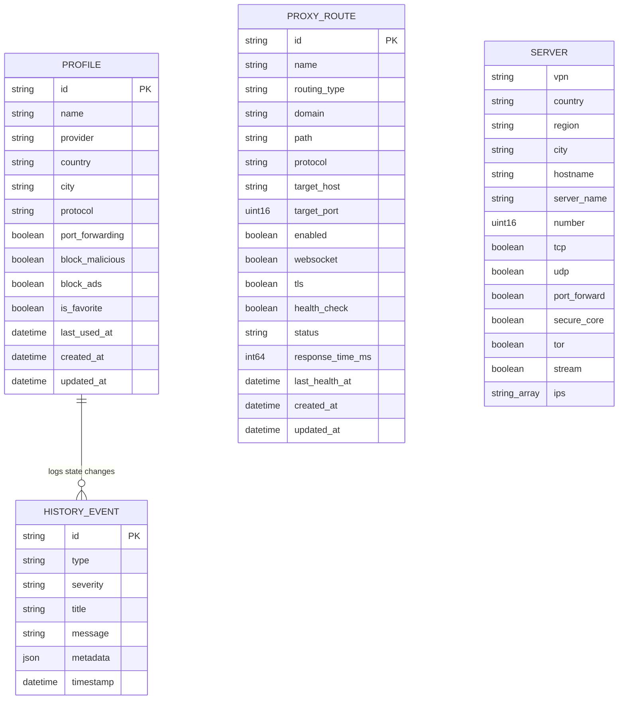

# Architecture: Database & Persistence Architecture

This document details the data storage architecture, models, persistence strategies, and concurrency controls used throughout the project.

---

## 1. Storage Paradigm

The project purposefully avoids heavy external database servers (such as PostgreSQL, MySQL, or MongoDB) to maintain an ultra-lightweight footprint, instant startup (<50ms), and zero external dependencies.

Instead, persistence is divided into two distinct tiers:
1. **Embedded Read-Only Server Catalog**: Thousands of global VPN server endpoints, IP addresses, capabilities, and coordinates embedded in binary assets and managed by [`internal/storage/`](file:///home/vedx/Videos/Gul/internal/storage/).
2. **Persistent Document Stores**: Thread-safe JSON document stores mounted on the persistent volume at `/data` (`profiles.json`, `history.json`, `proxy_routes.json`).

---

## 2. Entity Overview & Data Models

---

## 3. Persistent File Stores

### 3.1. Connection Profiles (`/data/profiles.json`)
Managed by [`internal/dashboard/profiles/store.go`](file:///home/vedx/Videos/Gul/internal/dashboard/profiles/store.go):
- Stores pre-configured connection profiles (server country, city, protocol, ad-blocking settings).
- **Concurrency**: Guarded by `sync.RWMutex`.
- **Atomic Writes**: Written to disk whenever a profile is created, updated, favorited, or deleted.
- **Seeding**: If the file does not exist on initial startup, default safe profiles (e.g. Switzerland Fast P2P, India Secure) are seeded automatically.

### 3.2. Audit Trail & History (`/data/history.json`)
Managed by [`internal/dashboard/history/store.go`](file:///home/vedx/Videos/Gul/internal/dashboard/history/store.go):
- Implements a fixed-size ring buffer of the last 1,000 chronological events.
- Captures:
  - `connection_state`: VPN connected, disconnected, reconnecting.
  - `ip_change`: Public IP migration from old IP to new IP with country.
  - `port_change`: Reallocation of dynamic port forwarding.
  - `error`: Health check failures or daemon warnings.
- **Diagnostic Export**: Endpoint `/api/dashboard/history/export` marshals the history store as an indented JSON diagnostics file for troubleshooting.

### 3.3. Reverse Proxy Routes (`/data/proxy_routes.json`)
Managed by [`internal/proxy/store.go`](file:///home/vedx/Videos/Gul/internal/proxy/store.go):
- Stores upstream target endpoints, routing rules (domain/path matchers), WebSocket flags, and health probe states.
- Writes complete desired route sets atomically. Caddy receives a candidate set
  before it is persisted; if persistence fails, the manager restores the prior
  Caddy configuration.
- The changing Proton public IP and forwarded port are runtime state only. They
  are never stored inside individual routes.

---

## 4. In-Memory Embedded Storage (`internal/storage/`)

Managed by [`internal/storage/storage.go`](file:///home/vedx/Videos/Gul/internal/storage/storage.go):
- Gluetun includes built-in server lists for over 20 VPN providers (ProtonVPN, Mullvad, PIA, AirVPN, Cyberghost, etc.).
- On startup, the storage layer decompresses and caches the servers in memory (`mergedServers.ProviderToServers`).
- Queries from the dashboard (`GET /api/dashboard/servers`) execute directly against memory, providing instant sub-millisecond filtering across 10,000+ server endpoints without disk or network latency.
