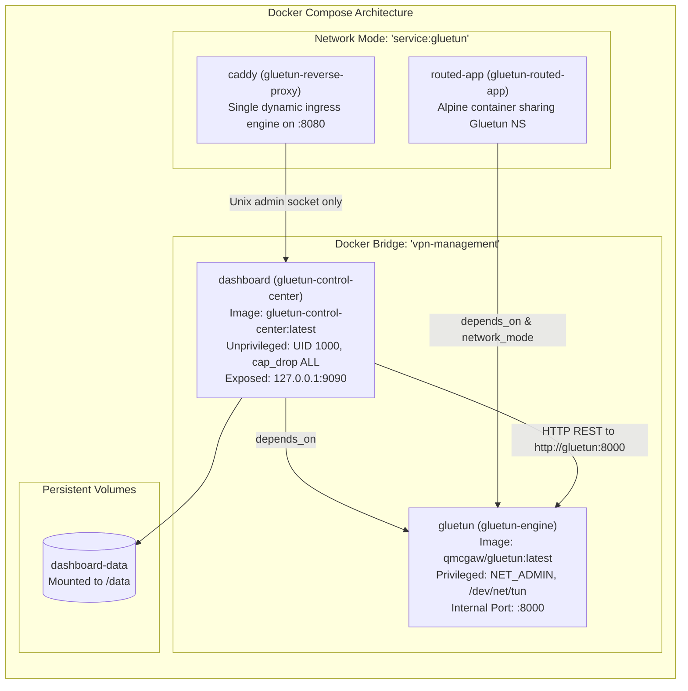

# Architecture: Docker & Container Architecture

This document details the containerization architecture, multi-stage Dockerfiles, Docker Compose orchestrations, privileges, and container security hardening.

---

## 1. Container Topology & Compose Services

The production deployment is defined in [`docker-compose.dashboard.yml`](file:///home/vedx/Videos/Gul/docker-compose.dashboard.yml):

---

## 2. Multi-Stage Docker Builds

### 2.1. Gluetun Engine Dockerfile (`Dockerfile`)
The engine Dockerfile uses 6 stages:
1. `xcputranslate`: Utility for cross-platform target architecture translation.
2. `golangci-lint` & `mockgen`: Tool binaries from `ghcr.io/qdm12/binpot`.
3. `base`: Go 1.26 Alpine environment with git, g++, findutils, and iptables.
4. `test` & `lint` & `mocks`: Automated CI verification stages.
5. `build`: Cross-compiles `entrypoint` from `cmd/gluetun/main.go` with `-ldflags="-s -w"`.
6. `final`: Alpine Linux base with OpenVPN, WireGuard tools, Unbound, CA certificates, and iptables.

### 2.2. Control Center Dashboard Dockerfile (`Dockerfile.dashboard`)
The dashboard Dockerfile uses 3 clean stages:
1. `frontend-builder`: Node 22 Alpine, runs `npm ci` and `npm run build` in `web/` to produce `dist/`.
2. `backend-builder`: Go 1.26 Alpine, copies the compiled `dist/` into `internal/dashboard/web/dist`, and compiles `cmd/gluetun-dashboard` with static linking (`CGO_ENABLED=0`) and stripped debug symbols (`-s -w`).
3. `final`: Alpine 3.21 minimal runtime:
   - Non-root user: `appuser` (UID/GID `1000:1000`).
   - Root filesystem mounted read-only (`read_only: true`).
   - Scratch memory provided via size-limited tmpfs (`/tmp:rw,noexec,nosuid,size=32m`).
   - Persistent volume at `/data`.

---

## 3. Defense-in-Depth Security Matrix

| Security Control | Gluetun Engine | Dashboard Control Center | Rationale |
|---|---|---|---|
| **Root User** | Required (UID 0) | **Disabled** (UID 1000 `appuser`) | Least privilege: web management needs no root access. |
| **Linux Capabilities** | `CAP_NET_ADMIN` | **Dropped ALL** (`cap_drop: [ALL]`) | Prevents container breakouts from web exploits. |
| **No New Privileges** | Set via daemon | **Enforced** (`no-new-privileges: true`) | Prevents SUID escalation inside container. |
| **Read-Only Root FS** | No (writes temporary configs) | **Enforced** (`read_only: true`) | Attacker cannot tamper with binary or static assets. |
| **Docker Socket** | **NOT MOUNTED** | **NOT MOUNTED** | Protects the host Docker daemon from compromise. |
| **Host Port Exposure** | Forwarded app port only | `127.0.0.1:9090` (loopback only) | Protects management API from external network scanning. |

---

## 4. Container Health Checks & Lifecycle

1. **Gluetun Engine Healthcheck**:
   - Command: `["CMD", "/gluetun-entrypoint", "healthcheck"]`
   - Interval: 15s | Timeout: 5s | Retries: 3 | Start Period: 10s
   - Tests ICMP or DNS reachability through the tunnel.
2. **Dashboard Healthcheck**:
   - Command: `wget --spider -q http://127.0.0.1:9090/api/dashboard/status || exit 1`
   - Interval: 15s | Timeout: 3s | Retries: 3 | Start Period: 5s
3. **Graceful Shutdown**:
   - Both containers trap `SIGTERM` and `SIGINT`.
   - The engine cleans up iptables rules and stops tunnel subprocesses.
   - The dashboard drains HTTP connections within 4 seconds and persists `/data/history.json`.

## 5. Public Application Ingress

The public-application feature uses one Caddy container, not one proxy per
application. Caddy and every exposed application share Gluetun's network
namespace through `network_mode: "service:gluetun"`. Each application must
listen on a unique loopback port, such as `127.0.0.1:3001`.

Proton assigns a dynamic public port. Gluetun's existing port-forward service
allows that port through the firewall and redirects it to Caddy's fixed local
listener on `:8080`. The Compose stack does not publish `:8080` to the Docker
host; Docker host port publishing is unrelated to VPN tunnel ingress.

Caddy's admin API uses `/run/caddy/admin.sock`, a `0600` Unix socket in the
shared `caddy-admin` volume. Only the dashboard and Caddy mount this volume.
Applications sharing Gluetun's network namespace do not receive that mount and
cannot administer Caddy.
