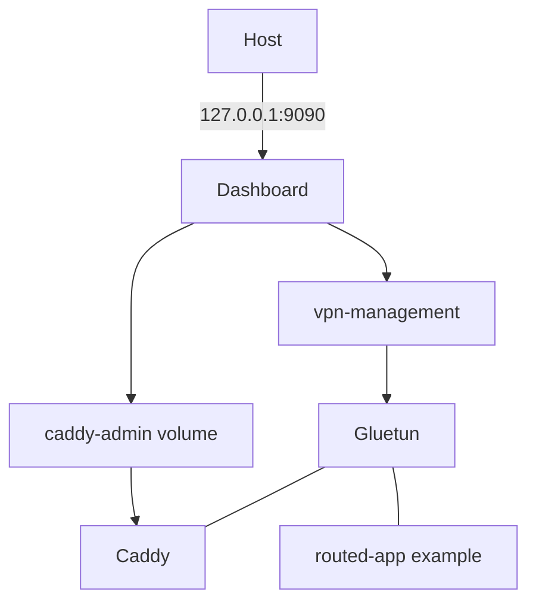

# Docker Architecture

## Images

- `Dockerfile` builds the privileged Gluetun engine image with Go, OpenVPN,
  iptables, and `gluetun-entrypoint`.
- `Dockerfile.dashboard` builds Vite assets then a Go dashboard binary, and
  runs it as UID `1000` in Alpine.
- Caddy uses `caddy:2.9-alpine` and `deploy/caddy/Caddyfile`.

## Runtime topology

`caddy-admin-init` prepares shared Caddy directories for UID `1000`. Caddy's
admin API listens on a mode-`0600` Unix socket; it is not published. Dashboard
has a read-only root filesystem, no Linux capabilities, a small `/tmp` tmpfs,
and only `127.0.0.1:9090` published. Gluetun receives `NET_ADMIN` and
`/dev/net/tun` because those are required for VPN networking.

## Persistent volumes

| Volume | Contents |
| --- | --- |
| `dashboard-data` | Profiles, history, proxy route JSON. |
| `caddy-admin` | Dashboard/Caddy-only admin socket. |
| `caddy-data`, `caddy-config` | Caddy runtime data and configuration. |

Gluetun and dashboard have healthchecks. Caddy relies on restart policy and
manager reconciliation rather than a Compose healthcheck.
