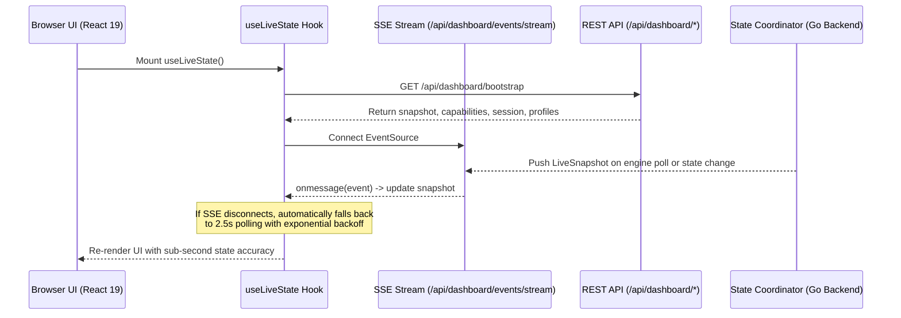

# Architecture: Frontend Architecture

This document describes the design, component tree, state management, and communication patterns of the **Gluetun Control Center** web interface.

---

## 1. Technology Stack

- **Framework**: React 19.0.0
- **Language**: TypeScript 5.7.2 (ES2022 target)
- **Build Tool**: Vite 6.0.3 with `@vitejs/plugin-react`
- **Styling**: Pure CSS variables (`theme.css`) implementing a dark cyber/glassmorphism theme; utility classes via `clsx`
- **Icons**: `lucide-react` (SVG icons)
- **Asset Distribution**: Embedded into the Go binary at compile time via `//go:embed all:dist`

---

## 2. Component Hierarchy & Layout

The user interface follows a single-page layout centered around [`DashboardLayout.tsx`](file:///home/vedx/Videos/Gul/web/src/layouts/DashboardLayout.tsx):

```text
App.tsx
 ├── ToastProvider (context for alert notifications)
 └── DashboardLayout
      ├── Header
      │    ├── System Status Badge (Engine Online / Offline / Mock Mode)
      │    ├── VPN Connection State Indicator (Connected / Connecting / Disconnected)
      │    ├── Active IP & Port Pill
      │    └── Navigation Tabs (Overview, Traffic, Connections, Routing, Firewall, DNS, Servers, etc.)
      │
      └── Page Content Router (renderCurrentPage)
           ├── OverviewPage (Hero Connection Card, Speed Gauges, Port Forwarding Endpoint, Quick Actions)
           ├── TrafficPage (Live bandwidth chart, per-app breakdown, destination hosts)
           ├── ConnectionsPage (Active TCP/UDP sockets, protocol, state)
           ├── RoutingPage (Linux routing table, gateway, subnets, interface rules)
           ├── FirewallPage (Kill-switch status, dropped packets counter, firewall events)
           ├── DNSPage (Encrypted DNS query statistics, ad-blocking metrics, cache latency)
           ├── DevicesPage (LAN clients routed through the VPN gateway)
           ├── SecurityPage (Threat alerts, DNS leak status, unencrypted traffic detection)
           ├── SystemPage (CPU, memory, kernel link stats, uptime)
           ├── ServersPage (Full-text search, filter by country/city/protocol/features, switch server)
           ├── PortForwardingPage (NAT-PMP lease timer, QR code export, client configuration tips)
           ├── ProfilesPage (Preset manager: create, edit, favorite, and one-click apply)
           ├── ActivityPage (Audit trail: IP shifts, port changes, disconnections, diagnostic export)
           └── SettingsPage (Telegram alerts toggle, bot credentials, theme, auth management)
```

---

## 3. State Management & Real-Time Sync

The frontend uses a two-tiered state management model:



### 3.1. `useLiveState` Hook
Defined in [`web/src/hooks/useLiveState.ts`](file:///home/vedx/Videos/Gul/web/src/hooks/useLiveState.ts):
- Establishes a persistent `EventSource` connection to `/api/dashboard/events/stream`.
- Listens to document `visibilitychange`: pauses polling when the tab is hidden and triggers an immediate refresh upon regaining focus.
- Tracks `isOffline` and `isStale` flags if communication is disrupted.

### 3.2. `useVPNState` Hook & Simulation Engine
Defined in [`web/src/hooks/useVPNState.ts`](file:///home/vedx/Videos/Gul/web/src/hooks/useVPNState.ts) and [`web/src/services/simulationEngine.ts`](file:///home/vedx/Videos/Gul/web/src/services/simulationEngine.ts):
- Provides 10 realistic test scenarios for local offline UI development (`connected`, `large_download`, `vpn_latency`, `tunnel_disconnect`, `vpn_reconnect`, `dns_leak`, `firewall_activity`, etc.).
- When `useLiveEngine` is enabled, seamlessly merges real Gluetun engine data into the display model.

---

## 4. API Client & Security Invariants

All communication is encapsulated in [`web/src/api/client.ts`](file:///home/vedx/Videos/Gul/web/src/api/client.ts):
- **CSRF Token Handling**: Reads the CSRF token upon login or bootstrap and attaches `X-CSRF-Token` to all mutating requests (`POST`, `PUT`, `DELETE`).
- **Same-Origin Credentials**: Configured with `credentials: 'same-origin'` to send session cookies safely.
- **Error Normalization**: Intercepts error JSON bodies (`APIErrorResponse`) and extracts actionable user error messages.

---

## 5. Styling Architecture

All visual styling is defined in [`web/src/styles/theme.css`](file:///home/vedx/Videos/Gul/web/src/styles/theme.css):
- **Color Palette**: Dark deep slate background (`#080c14`, `#0d1321`), neon cyan primary accents (`#00f0ff`), emerald success (`#10b981`), amber warning (`#f59e0b`), and crimson danger (`#ef4444`).
- **Glassmorphism**: Backdrop blur filters (`backdrop-filter: blur(12px)`), translucent border highlights (`rgba(255, 255, 255, 0.08)`), and soft radial gradients.
- **Typography**: Inter/system sans for headings and labels; JetBrains Mono/monospace for IP addresses, cryptographic fingerprints, and network ports.
