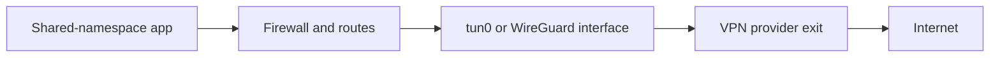
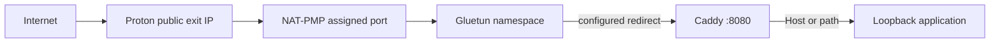

# Networking Architecture

## VPN egress

**VERIFIED** — Gluetun configures routing and firewall before starting its VPN
loop. The loop chooses a provider connection and starts OpenVPN, WireGuard, or
AmneziaWG. Its privileged networking packages own netlink, policy routes,
iptables, tunnel interfaces, DNS, health checks, public-IP lookup, and lease
renewal; dashboard code does not call those packages.

## Compose namespaces

| Service | Network position |
| --- | --- |
| `gluetun` | Owns the VPN namespace and joins `vpn-management`. |
| `caddy` | `network_mode: service:gluetun`; shares interfaces, routes, loopback, and ports. |
| `routed-app` | Example shared-namespace workload. |
| `dashboard` | Separate unprivileged bridge container; reaches `gluetun:8000`. |

Shared-namespace applications must use unique ports. Route defaults allow only
loopback targets, so `127.0.0.1:<unique-port>` is the normal target.

## Proton ingress

Proton requests TCP and UDP NAT-PMP mappings with 60-second leases and renews
them every 45 seconds. Compose fixes Gluetun forwarding's listener to `8080`.
The coordinator reads current IP/port from the native API and does not persist
them per route. A real Proton/DNS ingress test was not run in this analysis.
