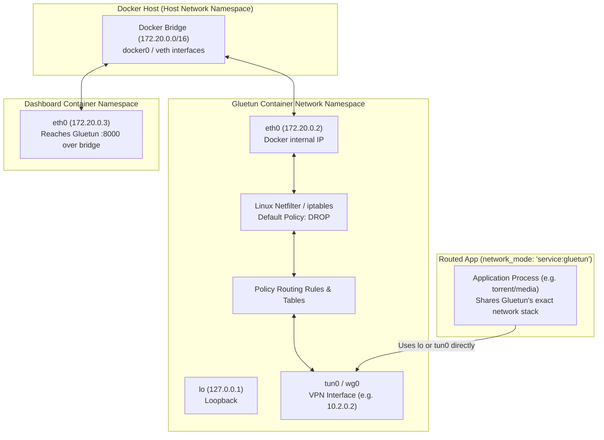
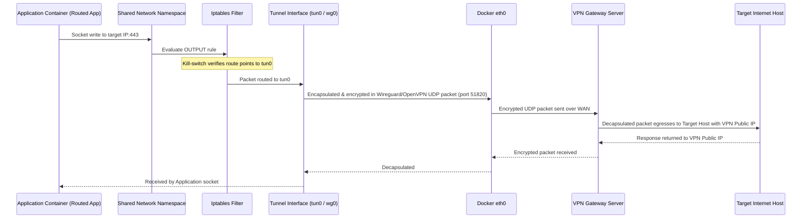
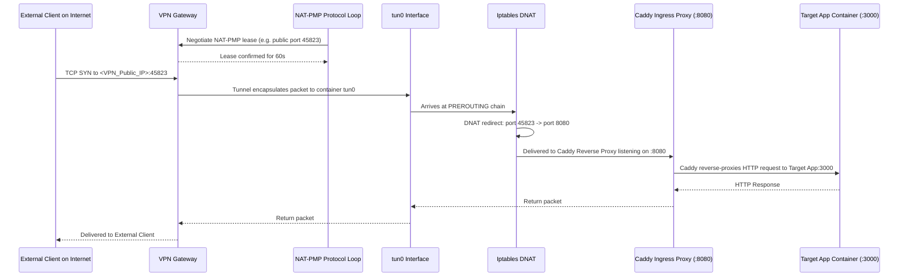

# Architecture: Networking Deep Dive

This document details the Linux network namespaces, interfaces, kernel routing tables, iptables firewall policies, and packet paths implemented in the codebase.

---

## 1. Network Namespaces & Docker Topology

Gluetun creates an isolated network bastion inside Docker:



### Namespace Sharing Semantics
- When an application container specifies `network_mode: "service:gluetun"`, the Docker daemon attaches it directly to Gluetun's network namespace (`/proc/<gluetun_pid>/ns/net`).
- The routed application does not have an `eth0` of its own; its `eth0` and `tun0` are identical to Gluetun's.
- If Gluetun's process exits, all routed application sockets immediately fail.

---

## 2. Kernel Firewall & Kill-Switch Policies

Implemented in [`internal/firewall/enable.go`](file:///home/vedx/Videos/Gul/internal/firewall/enable.go):

### 2.1. Default Drop Rule
On initialization, Gluetun sets the default policy of the `filter` table:
```bash
iptables -P INPUT DROP
iptables -P OUTPUT DROP
iptables -P FORWARD DROP
ip6tables -P INPUT DROP
ip6tables -P OUTPUT DROP
ip6tables -P FORWARD DROP
```

### 2.2. Conntrack Flush
To prevent existing sockets from leaking packets via the `ESTABLISHED,RELATED` rule, Gluetun flushes the kernel conntrack state:
```go
// [VERIFIED CURRENT] internal/firewall/flush.go
c.netLinker.FlushConntrack()
```

### 2.3. Allowed Rules
1. **Loopback**: Full access on `lo` interface (`iptables -A INPUT -i lo -j ACCEPT`, `iptables -A OUTPUT -o lo -j ACCEPT`).
2. **VPN Server Endpoint**: Allows outbound UDP/TCP to the designated VPN server IP and port over `eth0`.
3. **Local Networks**: Allows traffic to configured local subnets (e.g. `192.168.1.0/24`, `10.0.0.0/8`, `172.16.0.0/12`) so local hosts can access exposed services.
4. **Tunnel Interface**: Allows all input and output traffic through the tunnel interface (`tun0` or `wg0`).

---

## 3. Kernel Routing & Gateway Management

Implemented in [`internal/routing/`](file:///home/vedx/Videos/Gul/internal/routing/):

1. **Default Route Replacement**: The default route is directed via the VPN tunnel gateway IP (e.g. `10.2.0.1`), ensuring that all standard traffic is tunneled.
2. **Policy Routing Tables**: Custom routing tables (such as table `51820` for WireGuard or custom routing marks) isolate VPN traffic from local management traffic.
3. **Subnet Exclusions**: If `FIREWALL_OUTBOUND_SUBNETS` are specified, ip rules (`ip rule add to <subnet> table main priority <prio>`) are installed to route LAN traffic directly through `eth0` without entering the tunnel.

---

## 4. End-to-End Packet Flows

### 4.1. Outbound Traffic Path (Egress)
When an application container initiates an outbound HTTP/TLS connection:



### 4.2. Inbound Traffic Path via Dynamic Port Forwarding (Ingress)
When an external client connects to an internal application through the VPN forwarded port:



---

## 5. DNS Resolution & Leak Prevention

- **Encrypted DNS-over-TLS**: When `DOT=on`, Unbound runs locally, listening on `127.0.0.1:53`, encrypting all DNS queries via TLS to Cloudflare, Quad9, or custom upstream providers.
- **DNS Blocking**: Local malicious and advertising domain blacklists are loaded into Unbound.
- **Leak Protection**: In `internal/vpn/tunnelup.go`, the firewall explicitly blocks any outbound DNS traffic (UDP/TCP port 53) from bypassing the encrypted resolver.
