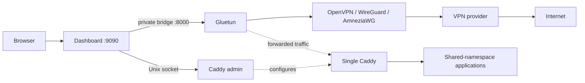

# System Overview

## Purpose

**VERIFIED** — This is a Gluetun fork: a privileged Go VPN engine plus a
separate Go/React dashboard control plane. The dashboard reads and changes a
small native control API surface, stores operator data as JSON, and configures
one Caddy instance with multiple HTTP application routes behind a ProtonVPN
forwarded port.

The dashboard never handles application packets. Gluetun, Caddy, and routed
applications form the data plane.

## Executables

| Entry point | Responsibility |
| --- | --- |
| `cmd/gluetun/main.go` | Privileged engine: settings, routing, firewall, VPN, DNS, port forwarding, native API. |
| `cmd/gluetun-dashboard/main.go` | Unprivileged dashboard: API, embedded SPA, polling, JSON stores, authentication, proxy manager. |
| `devrun/cmd/main.go` | Development Docker launcher with encrypted credentials. |
| `ci/cmd/main.go` | CI provider integration-test runner. |

## Invariants and limits

1. Gluetun owns kernel interfaces, routes, iptables, VPN state, public IP, and
   forwarding leases; dashboard code only uses its HTTP API.
2. `internal/proxy.Manager` sends all enabled routes to one Caddy config. It
   does not create a proxy or VPN connection per application.
3. Public IP and forwarded port are runtime endpoint state, not route fields.
4. Caddy control uses a non-published Unix socket shared only with dashboard.
5. Public TLS is currently rejected: DNS-01 or supplied-certificate support is
   not configured. Upstream `https` only means Caddy-to-application TLS.
6. Per-route metrics have an in-memory registry but no Caddy collector caller.
7. Several dashboard visual panels are simulation-derived unless live mode is
   enabled; this is not equivalent to engine telemetry.
