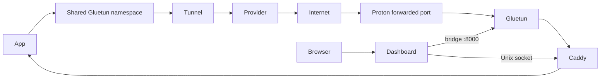

# Network Flow

`caddy` and `routed-app` use `network_mode: service:gluetun`; dashboard is a
separate unprivileged bridge container. Proton NAT-PMP requests TCP/UDP leases
for 60 seconds and renews them after 45 seconds. Compose forwards Gluetun's
assigned port to its stable namespace-local listener `:8080`. **VERIFIED**;
real external Proton/DNS reachability was not exercised.
