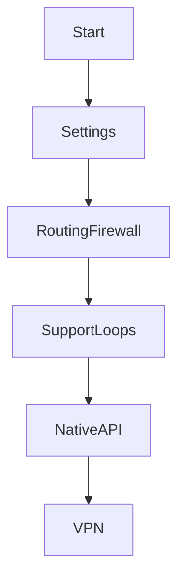

# Startup Flow

## Engine

`cmd/gluetun/main.go` creates the settings reader (secret files, config files,
then environment), applies defaults and validation, configures netlink routing
and firewall, starts metrics/port-forward/DNS/public-IP/SOCKS/health/updater
loops, creates the native API, then marks the VPN loop running. **VERIFIED**.

## Dashboard

`cmd/gluetun-dashboard/main.go` reads environment, creates a Gluetun client,
opens JSON stores, starts proxy reconciliation and coordinator polling, creates
auth/API/embedded SPA handlers, then listens. Compose starts Caddy after its
socket-volume initializer; manager reconciliation recovers a Caddy readiness
race. **VERIFIED**.
